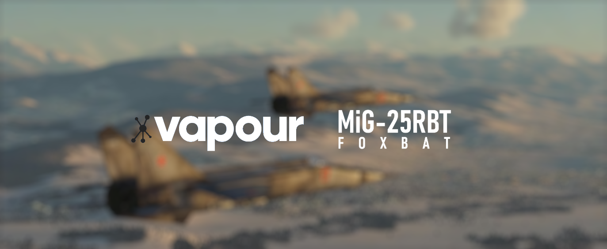

[](https://dsc.gg/vapourlabs)

<center>

**WARNING** |
-|
This mod is still in active development. |

</center>

## DCS: MiG-25RBT Foxbat
The MiG-25RBT is a single-seat reconnaissance-bomber with revised ELINT
equipment, the *Tangazh*, and a Peleng automatic bombing system. The aircraft
can carry a maximum of ten 500 kg. (1,100 lb.) bombs. It is among the fastest
military aircraft to enter service. Designed by the Soviet Union's Mikoyan-Gurevich
bureau, it is one of the few combat aircraft built primarily using stainless
steel.

At Vapour Labs, we are committed to make our mod a reality for DCS World
players.

### Features
Our modding project aims to achieve the following in great detail:

- A **1:1 accuracy** of the 3D models and systems of the aircraft.
- A fully authentic and high-fidelity community mod, with:
  - A completely custom **External Systems Model** (ESM) for various
    subcomponents and systems.
  - An aerodynamic emulation of the airframe's flight characteristics
    with our own **External Flight Model**. (EFM)
  - An immersive cockpit that is  **fully clickable** and chalk full of
    interactability.
- Being free and **open-sourced** for the community to use, contribute to
  and modify in any shape or form.

More planned features are yet to come, this list is subject to change at 
any given moment. Please refer to the commit history for changes.

### Installing
In order to install the mod, you will need to have the Git bash terminal
downloaded and installed on your computer. Once that is done, please run
the following line in your terminal:

```bash
$ git clone --recursive https://github.com/vapourlabs/mig-25rbt.git
```